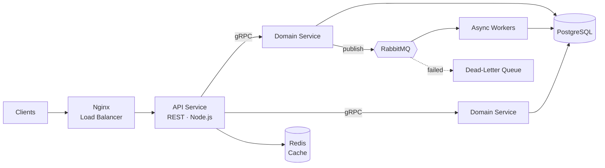

 

 

## About Me

I am a backend software engineer and a Master's student in Software Engineering at Memorial University of Newfoundland. Before moving to Canada, I spent five years at SWIFT Technology, growing from intern to full-time Software Engineer and building production backends used every day.

I care about systems that stay correct and available under load: well-designed APIs, reliable messaging, fast queries, and failures that are handled instead of hidden.

<table>
<tr>
<td width="50%" valign="top">

**Currently**

- Master's student, Software Engineering, Memorial University of Newfoundland
- Studying distributed systems and software architecture
- Exploring Kubernetes, event sourcing, and CQRS

</td>
<td width="50%" valign="top">

**Open to**

- Internships and co-op placements
- Full-time backend engineering roles
- Open-source collaboration and system design discussions

</td>
</tr>
</table>

## Career Timeline

| Period | Role | Organization |
| :--- | :--- | :--- |
| **Sep 2026 – Present** | Master's Student, Software Engineering | Memorial University of Newfoundland, Canada |
| **Jan 2023 – Jul 2026** | Software Engineer (full-time) | SWIFT Technology, Nepal |
| **2022 – 2023** | Trainee Software Engineer (part-time) | SWIFT Technology, Nepal |
| **2021** | Software Engineering Intern (part-time) | SWIFT Technology, Nepal |

## Tech Stack

  

## How I Design Systems

| Principle | In practice |
| :--- | :--- |
| **Resilience** | Circuit breakers, retries with backoff, graceful degradation, health checks |
| **Scalability** | Stateless services, horizontal scaling, load balancing, connection pooling |
| **Performance** | Redis caching, query optimization, strategic indexing, async processing |
| **Messaging** | Pub/sub, dead-letter queues, idempotent consumers |
| **Observability** | Structured logging, metrics, tracing, alerting |

## Featured Projects

<!-- TODO: Replace with 2-3 real projects and pin the same repos on your profile.
     For each: what it does, the hard problem, and one measured result. -->

| Project | What it does | Stack |
| :--- | :--- | :--- |
| **[Project name](https://github.com/abishekpaudel/REPO)** | What it does, the hardest problem you solved, and one measured result. | `TypeScript` `PostgreSQL` `RabbitMQ` |
| **[Project name](https://github.com/abishekpaudel/REPO)** | What it does, the hardest problem you solved, and one measured result. | `Node.js` `gRPC` `Redis` |

## GitHub Activity

 

## Get in Touch

I am always glad to talk about backend engineering, system design, or a role where I can contribute.

